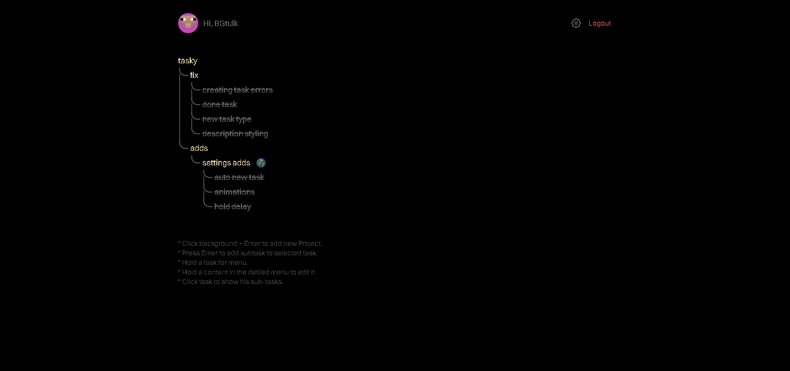
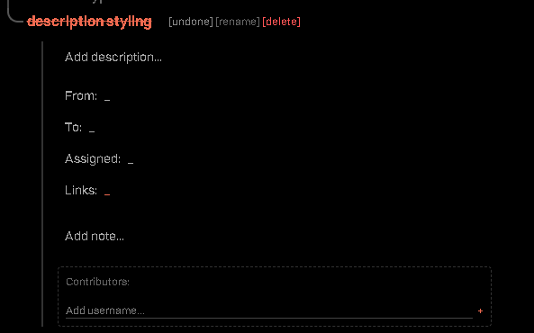

# Tasky

Tasky is a professional task management application designed for hierarchical organization and efficient collaboration.   Built with a modern tech stack, it provides a seamless experience for managing complex projects through a recursive task tree structure.

## Core Features

- Hierarchical Task Management: Create nested subtasks with no depth limits.
- Real-time Collaboration: Share tasks with other users and manage contributors.
- User Profiles: Customizable avatars and secure account management.
- Advanced Preferences: Granular control over sorting, task behavior, and UI interactions.
- Glassmorphism UI: Modern and responsive design with smooth transitions.

## Live Demo

The application is deployed and available at: [tasky.bgtulk.dev](https://tasky.bgtulk.dev)

## Screenshots

## Tech Stack

- Frontend: React 19, Vite, Axios, Context API.
- Backend: Node.js, Express.
- Database: PostgreSQL (Neon / @vercel/postgres).
- Authentication: JSON Web Tokens (JWT) with bcryptjs for secure password hashing.
- Security:  Helmet.js for header security and Express Rate Limit for DDoS protection.
- Analytics: Vercel Analytics integration.

## Getting Started

### Installation

1. Clone the repository.
2. Run `npm install` in the root directory . This will automatically install dependencies for both client and server.

### Configuration

Create a `.env` file in the root and server directories with the following variables:

DATABASE_URL=your_postgres_url
JWT_SECRET=your_jwt_secret

### Running the Application

To start both the client and server in development mode:

1. In one terminal, run: `npm run dev` (starts the server)
2. In another terminal, navigate to the client directory and run: `npm run dev` (starts the Vite dev server)

## Security

Tasky implements several security best practices:
- Password Hashing: Using bcryptjs with a salt factor of 10.
- JWT Authentication: Secure stateless session management .
- Rate Limiting: Protection against brute-force attacks on auth endpoints.
- XSS/Header Security:  Helmet.js integration.

